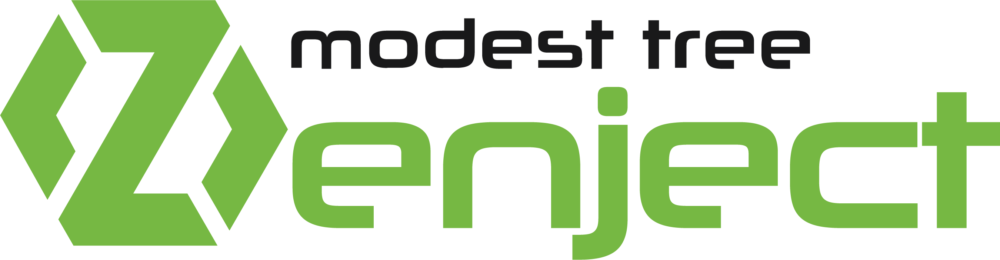
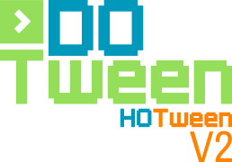

# Welcome to my GitHub Profile! 🚀

👋 Hey there! I'm Davut, a passionate Unity developer currently on the lookout for a new, exciting opportunity. On my GitHub, you'll find a variety of projects showcasing my skills and interests, ranging from Unity development to data analysis using Python and R. I'm constantly updating my knowledge, and you'll often find me delving into the intricacies of C#, Zenject, DoTween, and the Oculus SDK.
_______________________________________________________________________________________________________________
## About Me
- 👨‍💻 Unity Developer
- 🌱 Enhancing my OOP, patterns skills
- 🚀 Currently creating cool Unity modules to enhance projects
- 💡 Constantly seeking new challenges to push my skills further

## Current Projects
I'm currently focused on enriching the Unity development experience by working on a module packed with exciting features that'll take Unity projects to the next level. You can expect some cool code snippets and innovative solutions to common Unity challenges.

## Tools
In my day-to-day work, I rely on a set of tools that help me bring my ideas to life. These include:

<body>
    <table align="center">
        <tr>
            <th align="center" width="60%">Main languages and tools</th>
            <th align="center" width="40%">Additional languages and tools</th>
        </tr>
        <tr>
            <td align="center">
                
                
                
            </td>
            <td></td>
        </tr>
        <tr>
            <td align="center">
                
            </td>
            <td></td>
        </tr>
        <tr>
            <td align="center">
                
                
                
                
            </td>
            <td></td>
        </tr>
        <tr>
            <td align="center">
                
                
            </td>
            <td></td>
        </tr>
        <tr>
            <td align="center">
                
                
                
            </td>
            <td></td>
        </tr>
    </table>
</body>

Feel free to have a look around and explore some of the fascinating projects I'm working on. If you're interested in collaborating or have exciting opportunities, don't hesitate to get in touch! I'm all ears for a good conversation or a thrilling venture. Let's make cool things happen together! 🌟

## Contact me

P.S. Did I mention that I love discussing new tech, sharing insights, and coding? So, if you're into any of that, we're going to get along just fine! Cheers! 🎮📊🚀

